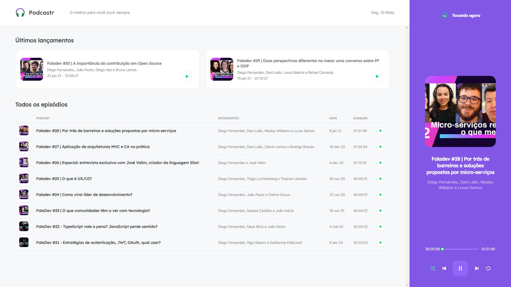

# Podcastr
Este é o Podcastr, projeto desenvolvido durante o evento NextLevelWeek5 seguindo a trilha de React.

Este projeto é uma aplicação Web de um podcast, onde é possível conferir os últimos lançamentos e ouvir todos os episódios, utilizando todas as funcionalidades de um player: Play/Pause, Play Next/Previous, Repeat & Shuffle.

 

 

🚀As principais tecnologias e conceitos utilizados:
<ul>
<li>SASS - Pré-processador CSS</li>
<li>Next.JS - Framework React</li>
<li>Typescript</li>

<li>Server Side Rendering</li>
<li>Static Site Generetion</li>
<li>Context API</li>

</ul>
